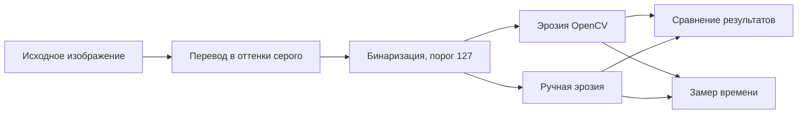
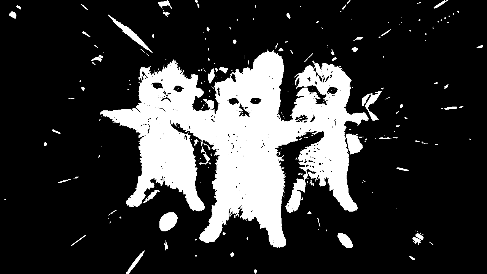
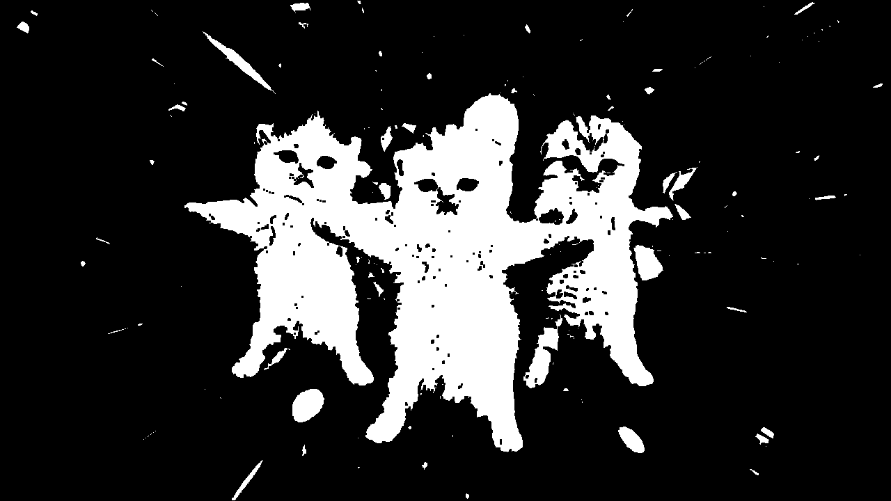
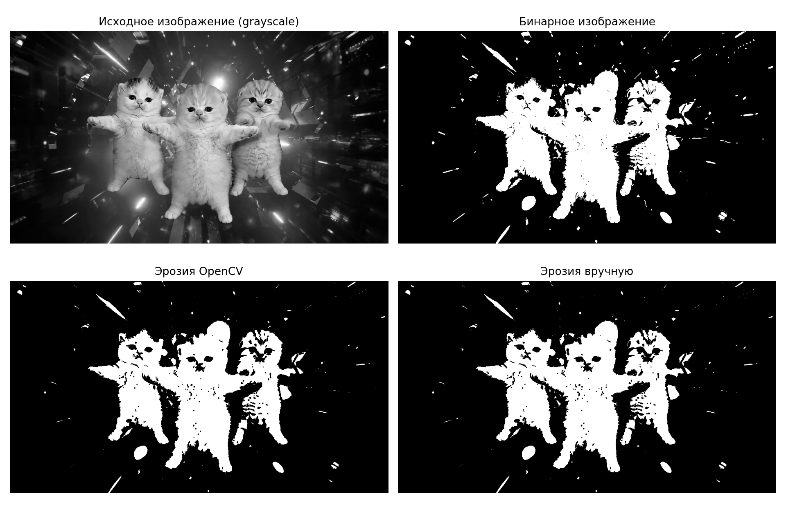
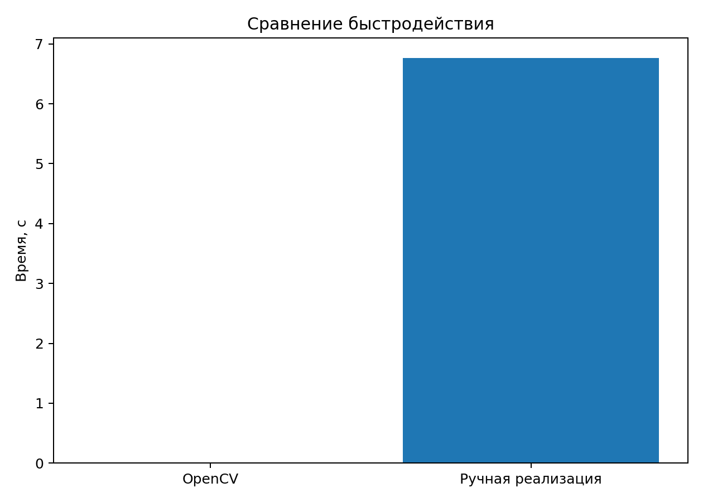

# Лабораторная работа №1

## Эрозия бинарного изображения

### Цель работы

Научиться реализовывать простой алгоритм обработки изображений и сравнить библиотечную и нативную реализации по быстродействию.

В данной работе реализован **вариант 7 — эрозия с примитивом 3×3**. Бинаризация изображения выполняется библиотечными средствами, так как по условию варианта её не требуется реализовывать вручную.

---

## 1. Теоретическая база

**Эрозия** — морфологическая операция обработки бинарных изображений. Она уменьшает белые области изображения и расширяет чёрные области относительно границ объектов.

В работе используется структурный элемент размером **3×3**:

```text
1 1 1
1 1 1
1 1 1
```

Для каждого пикселя рассматривается окрестность 3×3. Центральный пиксель результата становится белым (`255`) только в том случае, если **все 9 пикселей** соответствующей области исходного бинарного изображения белые. Если хотя бы один пиксель равен `0`, в результате записывается `0`.

Для обработки границ изображения в обеих реализациях принято одинаковое правило: за пределами изображения считаются расположенными чёрные пиксели (`0`). В ручной реализации для этого используется `padding`, а в OpenCV — `BORDER_CONSTANT` с `borderValue=0`.

---

## 2. Описание разработанной системы

Работа выполнена на **Python** в среде **Google Colab**. Использованы библиотеки:

- `OpenCV` — загрузка изображения, бинаризация и библиотечная реализация эрозии;
- `NumPy` — работа с массивами и ручная реализация алгоритма;
- `Matplotlib` — визуализация результатов;
- `time` — измерение времени выполнения.

Общая последовательность обработки:



### 2.1. Загрузка изображения

Изображение загружается сразу в оттенках серого:

```python
image = cv2.imread("/content/kittens.png", cv2.IMREAD_GRAYSCALE)
```

Каждый пиксель после этого представлен одним значением яркости от `0` до `255`.

Исходное изображение:


Изображение в оттенках серого:


### 2.2. Бинаризация

Бинаризация выполняется с фиксированным порогом `127`:

```python
_, binary = cv2.threshold(
    image,
    127,
    255,
    cv2.THRESH_BINARY
)
```

Пиксели с яркостью выше порога становятся белыми (`255`), остальные — чёрными (`0`).



### 2.3. Эрозия средствами OpenCV

Создаётся структурный элемент 3×3:

```python
kernel = np.ones((3, 3), dtype=np.uint8)
```

Затем выполняется эрозия:

```python
eroded_cv = cv2.erode(
    binary,
    kernel,
    iterations=1,
    borderType=cv2.BORDER_CONSTANT,
    borderValue=0
)
```



### 2.4. Нативная реализация на Python

Для ручной реализации изображение сначала дополняется чёрной рамкой толщиной один пиксель:

```python
padded = np.pad(
    image,
    pad_width=1,
    mode='constant',
    constant_values=0
)
```

После этого алгоритм проходит по каждому пикселю и анализирует его окрестность 3×3:

```python
def erosion_manual(image):
    height, width = image.shape

    padded = np.pad(
        image,
        pad_width=1,
        mode='constant',
        constant_values=0
    )

    result = np.zeros_like(image)

    for y in range(height):
        for x in range(width):
            region = padded[y:y+3, x:x+3]

            if np.all(region == 255):
                result[y, x] = 255
            else:
                result[y, x] = 0

    return result
```


---

## 3. Результаты работы и тестирования

Итоговые изображения:



### 3.1. Проверка корректности

Для проверки библиотечной и ручной реализаций вычислялась абсолютная разница между изображениями:

```python
difference = cv2.absdiff(eroded_cv, eroded_manual)
different_pixels = np.count_nonzero(difference)
```

В финальной версии программы получен результат:

```text
Количество отличающихся пикселей: 0
```

Следовательно, при одинаковом способе обработки границ библиотечная и ручная реализации дают **полностью совпадающий результат**.

Изображение разницы является полностью чёрным, поскольку отличающихся пикселей нет:


### 3.2. Сравнение быстродействия

Для измерения времени использовалась функция `time.perf_counter()`.

В конкретном запуске Google Colab были получены следующие значения:

| Реализация | Время выполнения |
|---|---:|
| OpenCV | 0.001343 с |
| Ручная реализация Python | 6.764209 с |

Отношение времени выполнения:

```text
6.764209 / 0.001343 ≈ 5037.54
```

Таким образом, в данном запуске библиотечная реализация OpenCV оказалась примерно в **5037.54 раза быстрее** ручной реализации на Python.



Такое различие объясняется тем, что ручной вариант содержит вложенные циклы Python и последовательно обрабатывает каждый пиксель. OpenCV использует оптимизированные низкоуровневые реализации операций над массивами изображений.

Значения времени зависят от используемого оборудования и текущей нагрузки среды выполнения, поэтому приведённые результаты относятся к конкретному запуску программы.

---

## 4. Выводы

В ходе лабораторной работы был реализован алгоритм морфологической эрозии бинарного изображения со структурным элементом 3×3.

Алгоритм реализован двумя способами:

1. с использованием функции `cv2.erode()` библиотеки OpenCV;
2. нативно на Python с последовательной обработкой каждого пикселя и его окрестности 3×3.

Для обеих реализаций было установлено одинаковое правило обработки границ изображения. В результате попиксельное сравнение показало **0 отличающихся пикселей**, что подтверждает корректность ручной реализации.

Сравнение времени выполнения показало значительное преимущество библиотечной реализации: в выполненном эксперименте OpenCV отработал примерно в **5037.54 раза быстрее** ручного варианта.

Цель работы достигнута: реализован алгоритм обработки изображения, выполнены библиотечная и нативная версии, проверена корректность результатов и проведено сравнение быстродействия.

---

## 5. Использованные источники

1. OpenCV Documentation — Morphological Transformations: https://docs.opencv.org/4.x/d9/d61/tutorial_py_morphological_ops.html
2. OpenCV Documentation — Image Thresholding: https://docs.opencv.org/4.x/d7/d4d/tutorial_py_thresholding.html
3. NumPy Documentation — `numpy.pad`: https://numpy.org/doc/stable/reference/generated/numpy.pad.html
4. Python Documentation — `time.perf_counter`: https://docs.python.org/3/library/time.html#time.perf_counter

---

## Файлы проекта

```text
lab1_erosion/
├── README.md
├── lab1_erosion.ipynb
├── kittens.png
└── images/
    ├── 00_source.png
    ├── 01_grayscale.png
    ├── 02_binary.png
    ├── 03_eroded_opencv.png
    ├── 04_eroded_manual.png
    ├── 05_difference.png
    ├── 06_performance.png
    └── 07_results_grid.png
```
